Começando com UML, mas acho que vou ter que fazer notas futuras a parte sobre ele, pois sei muito pouco 🚀

- [UML](#uml)
  - [Classe](#classe)
  - [Agregação](#agregação)
  - [Composição](#composição)
  - [Dependencia](#dependencia)
  - [Realization](#realization)
  - [Abstract](#abstract)
- [Design patterns](#design-patterns)
  - [Creational](#creational)
    - [Singleton](#singleton)
    - [Builder](#builder)
    - [Prototype](#prototype)
    - [Factory method](#factory-method)
    - [Abstract factory](#abstract-factory)
  - [Estrutural](#estrutural)
    - [Composite](#composite)
  - [Adapter](#adapter)
  - [Bridge](#bridge)
  - [Decorator](#decorator)
  - [Facade](#facade)
  - [Proxy](#proxy)
    - [Proxy virtual](#proxy-virtual)
    - [Proxy remoto](#proxy-remoto)
    - [Proxy de proteção](#proxy-de-proteção)
    - [Proxy inteligente](#proxy-inteligente)

# UML

## Classe

Exemplo de classe abaixo:

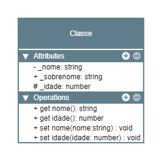

```ts
export class Classe {
  constructor(
    private _nome: string,
    public _sobrenome: string,
    protected _idade: number
  ) {}

  public get nome(): string {
    return this._nome
  }

  public get idade(): number {
    return this._idade
  }

  public set nome(nome: string) {
    this._nome = nome;
  }

  public set idade(idade: number){
    this._idade = idade
  }
}
```

## Agregação

Uma classe funciona sem a outra, porém para que ela funcione adequadamente ela precisaria receber a outra classe. Uma classe incrementa a outra.

Exemplo

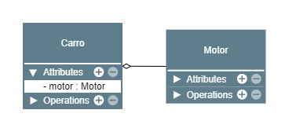

```ts
export class Motor {}

export class Carro {
  private motor: Motor;

  constructor(motor: Motor){
    this.motor = motor;
  }
}

const motor = new Motor;
const carro = new Carro(motor)
```

No exemplo a cima um carro consegue existir sem um motor

## Composição

Quando uma classe é totalmente dependente da outra. Logo uma classe não pode existir sem a outra.

Exemplo


```ts
class Motor {}

class Carro {
  private motor = new Motor()
}
```
No exemplo acima, um carro não consegue existir sem o Motor.

## Dependencia

Quando uma entidade depende de outra para funcionar

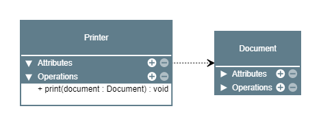

```ts
export class Document {}

export class Printer {
  print(document: Document){
    console.log(`Printing document: ${document}`)
  }
}
```

## Realization

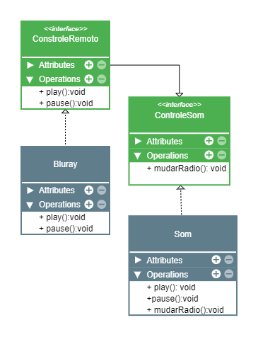

```ts
interface ControleRemoto {
  play():void;
  pause():void;
}

class Bluray implements ControleRemoto{
  play(): void {}
  pause(): void {}
}

interface ControleSom extends ControleRemoto{
  mudarRadio():void;
}

class Som implements ControleSom{
  mudarRadio(): void {}
  play(): void {}
  pause(): void {}
}
```

## Abstract

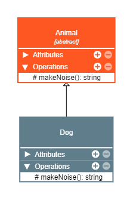


```ts
abstract class Animal {
  abstract makeNoise() :string
}

class Dog extends Animal{
  makeNoise(): string {
    return 'Random noise'
  }
}
```


# Design patterns

São vários! Então vamos repassar alguns ✅

## Creational

Padões para criação de objetos ❤

### Singleton

Receber somente uma instancia de uma entidade em todo programa. Para que isso aconteca é necessário ter uma trativa na criação da entidade.

Estrutura

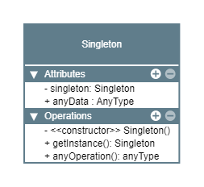

exemplo de singleton classico
```ts
export class Carro {
  private static _carro: Carro | null = null;

  private constructor() {}

  static get carro(): Carro {
    if (Carro._carro === null) {
      Carro._carro = new Carro();
    }

    return Carro._carro;
  }
}
```

### Builder

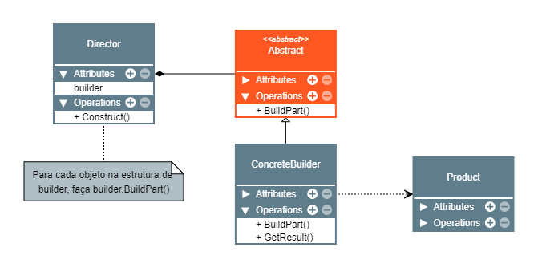

Separar a criação de um objeto complexo da sua representação de modo que o mesmo processo de construção, possa criar diferentes representações.

> Código para o cliente

- Código que cria
- Código que usa

Utilizado em construção de objetos complexos
- Construtores muito complexos
- Composição de vários objetos (Composite)

- Permite a criação de um objeto em etapas
- Permite o method chaining - Encadeamento de chamadas de métodos

Esse método de criação de entidades para o cliente, remove a complexidade para o cliente, deixando-o somente com maneira faceis de invocar entidades para ele.

Exemplo simples, mas nos `src/builder/exemplo-complexo` existe um exemplo mais real :)

`Person.ts`

```ts
export class Person {
  constructor(public name?: string, public age?: number) {}
}
```

`personBuilder.ts`

```ts
import { Person } from './person';

export class PersonBuilder {
  private person = new Person();

  newPerson(): void {
    this.person = new Person();
  }

  setName(name: string): this {
    this.person.name = name;
    return this;
  }

  setAge(age: number): this {
    this.person.age = age;
    return this;
  }

  getResult(): Person {
    return this.person;
  }
}
```

`main.ts`

```ts
import { PersonBuilder } from './personBuilder';

const personBuilder = new PersonBuilder();
const person1 = personBuilder.setName('Albert').setAge(76).getResult();
personBuilder.newPerson(); // Reset do builder
const person2 = personBuilder.setName('Nicola').setAge(86).getResult();

console.log(person1);
console.log(person2);
```

### Prototype

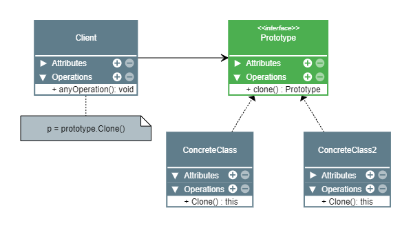

Especificar os tipos de objetos a serem criados usando uma instancia-protótipo e criar novos objetos pela cópia desse protótipo

> Criar novos objetos a partir da instancia do objeto

Temos um objeto criado e então se precisa de outro objeto, logo não fazemos new Object(), fazemos Object.create(object). Dessa maneira estamos criando um novo objeto utilizando o protótipo que passamos como parametro.

- O tipo do objeto a ser criado é determinado pelo objeto protótipo
- é tipicamente usado para evitar a recriação de objetos caros
- Ajuda a evitar a explosão de subclasses
- Pode (ou não) manter um registro de objetos protótipo em um objeto separado
- Geralmente é criado apenas como um método 'clone' dentro do objeto protótipo
- O metódo clone pode gerar uma 'shallow' ou 'deep' copy do objeto protótipo
- Evita que o cliente conheça as classes que criam o objeto. Para depender das classes concretas

> É necessário tomar cuidado ao utilizar a maneira padrão de cópia, que é a shallow copy. Essa maneira de cópia pode causar alterações em seus objetos clonados, se houver uma alteração no objeto 'pai'.

> Para clonar objetos de maneira mais segura (Para que não haja alterações), é necessário realizar uma deep copy. Que pode ser implementada na sua estrutura ou utilizar biblioteca de terceiros, como o lodash.

Exemplo

```ts
interface Prototype {
  clone(): Prototype;
}

class Person implements Prototype {
  constructor(public name: string) {}

  clone(): this {
    const newPerson = Object.create(this);
    return newPerson;
  }
}

const person = new Person('Albert');
const newPerson = person.clone();

person.name // Albert
newPerson.name // Albert
```

Exemplo simples

```ts
const person = {
  name: 'Albert'
}

const newPerson = Object.create(person)

person.name // Albert
newPerson.name // Albert
```

### Factory method

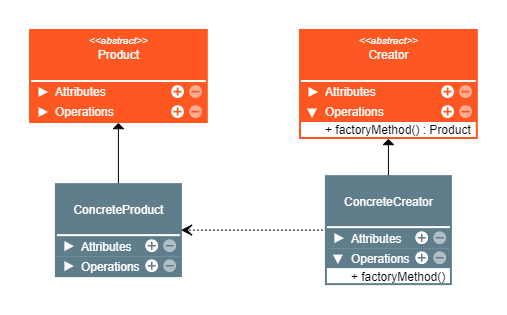

Definir uma interface para criar um objeto, mas deixar as subclasses decidirem que classe instanciar. O Factory method permite adiar a instanciação para as subclasses.

Simplesmente operações que criam objetos.

Muito boa para nunca deprender diretamente de classes concretas, deixando assim seu código desacoplado.

Exemplo

```ts
interface Product {
  sayHi(): void;
}

export class concreteProduct implements Product {
  sayHi(): void {
    console.log('Hi!');
  }
}

abstract class Creator {
  abstract factoryMethod(): Product;

  creteAndShow(): void {
    const product = this.factoryMethod();
    console.log(product);
  }
}

export class ConcreteCreator extends Creator {
  factoryMethod(): Product {
    return new concreteProduct();
  }
}

const creator = new ConcreteCreator();
const product = creator.factoryMethod();
product.sayHi();
creator.creteAndShow();
```

### Abstract factory

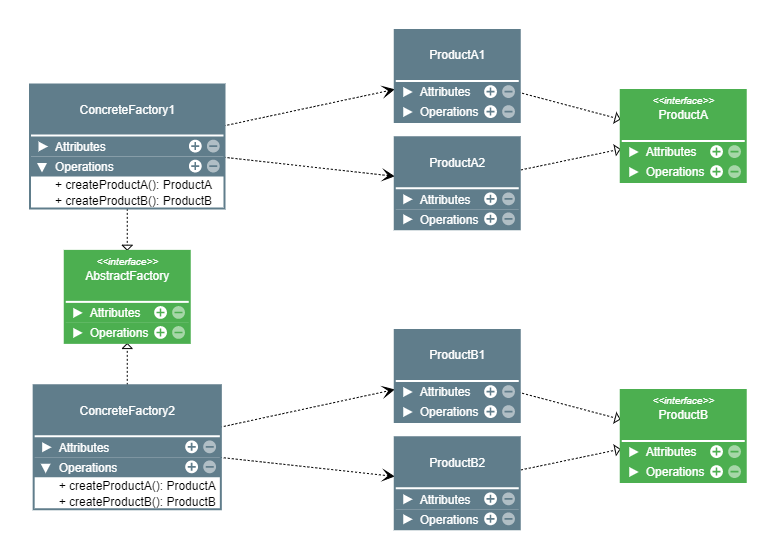

Fornecer uma interface para a criação de familias de objetos relacionados ou independentes sem especificar suas classes concretas.

- É um padrão de criação assim como o factory method
- Usa os factorys methods
- Cria objetos agrupando por objetos compátiveis
- Super foco em interfaces
- Permite criar restrições para garantir que um objeto está utilizando os objetos de sua familia


Exemplo simples de fabrica de veiculos:
```ts
interface VehicleProtocol {
  name:string
}

class VehicleClass implements VehicleProtocol {
  constructor(public name:string) {};
}

interface VehicleFactory {
  createVehicle(name: string): VehicleProtocol;
}

class VehicleFactory implements VehicleFactory{
  createVehicle(name: string) {
    return new VehicleClass(name);
  }
}

const vehicleFactory = new VehicleFactory();
const vahicle = vehicleFactory.createVehicle('Fusca');
console.log(vehicle.name) //fusca
```

## Estrutural

Padrões para cuidar da estrutura do projeto

### Composite

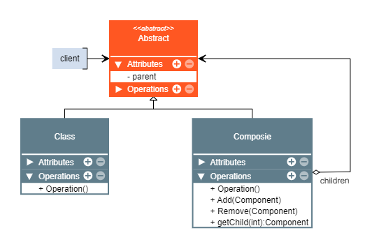

Se preocupam com a forma como os objetos são compostos para formar estruturas maiores

Compor objetos em estruturas de arvore para representar hierarquis partes/todo. Composite permite aos clientes tratarem de maneira uniforme objetos individuais e composições de objetos.

> Vai criando os objetos por partes

- É um padrão estrutural
- Faz sentido em estruturas que podem ser tratadas hieraquicamente
- Prioriza a composição em vez de herança
- Exemplo: Produto solto com preço e caixa com vários do mesmo produtos também com preço

Muito parecido com uma arvore binaria


- Interface em comum para objetos 'Composite' e 'Leaf'
- Objetos composites são objetos que tem filho e não fazem trabalho. Ele delega as tarefas para seus filhos
- Objetos leaf são aqueles quem executam as tarefas

Aplicabilidade

- Deve ser utilizada quando a estrutura do projeto pode ser representada hierárquicamente
- Quando quiser que o código cliente trate tanto objeto simples quanto compostos da mesma maneira
- Maior facilidade em compor estruturas, como por exemplo validações

Exemplo - Aplicando composite para construir uma estrutura de validações

```ts
export abstract class Validate {
  abstract validate(value: any): boolean;
}

export class ValidateEmail extends Validate {
  validate(value: any): boolean {
    if (typeof value !== 'string') return false;
    return /@/.test(value);
  }
}

export class ValidateString extends Validate {
  validate(value: any): boolean {
    return typeof value === 'string';
  }
}

export class ValidateComposite extends Validate {
  private readonly children: Validate[] = [];

  add(...components: Validate[]): void {
    components.forEach((component) => this.children.push(component));
  }

  remove(component: Validate): void {
    const index = this.children.indexOf(component);
    this.children.splice(index, 1);
  }

  validate(value: any): boolean {
    for (const child of this.children) {
      const validation = child.validate(value);
      if (!validation) return false;
    }
    return true;
  }
}

const validateEmail = new ValidateEmail();
const validateString = new ValidateString();

const validateComposite = new ValidateComposite();
validateComposite.add(validateEmail, validateString);

console.log(validateComposite.validate('teste@')); //true
```

## Adapter

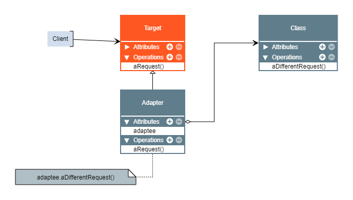

Converte a interface de uma classe em outra interface esperada pelo cliente. O adapter permite que classes trabalhem em conjunto, pois de outra forma seria impossível por conta de suas interfaces imcompativeis.

- Faz exatamente oque adaptadores físicos do mundo real faz, por exemplo o adaptador da tomada permite que tomadas com encaixes diferentes se conectem.
- Pode ser utilizado para adaptar interfaces de códigos legados para novo códigos
- Resumindo adapta qualquer interface para qualquer outra interface :3

O meme de novo rsrsrs


> Mas o melhor é sem dúvida que ele permite que você dependa de coisas somente do seu dominio, colocando todos as coisas de terceiros em adaptadores.
>
> Oque é muito bom devido a sibstituição de libs externas ou códigos legados

Exemplo

`validateEmailProtocol.ts`

```ts
export interface ValidateEmailFnProtocol {
  (email: string): boolean;
}
```

`emailValidatorAdapter.ts`

```ts
import isEmail from 'validator/lib/isEmail';
import { ValidateEmailFnProtocol } from '../interfaces/validateEmailProtocol';

export const emailValidatorFnAdapter: ValidateEmailFnProtocol = (
  email: string,
): boolean => {
  return isEmail(email);
};
```

`main.ts`

```ts
import { emailValidatorFnAdapter } from './validation/emailValidatorFnAdapter';

const email = 'albert@science.com';
console.log(emailValidatorFnAdapter(email)) //true
```

## Bridge

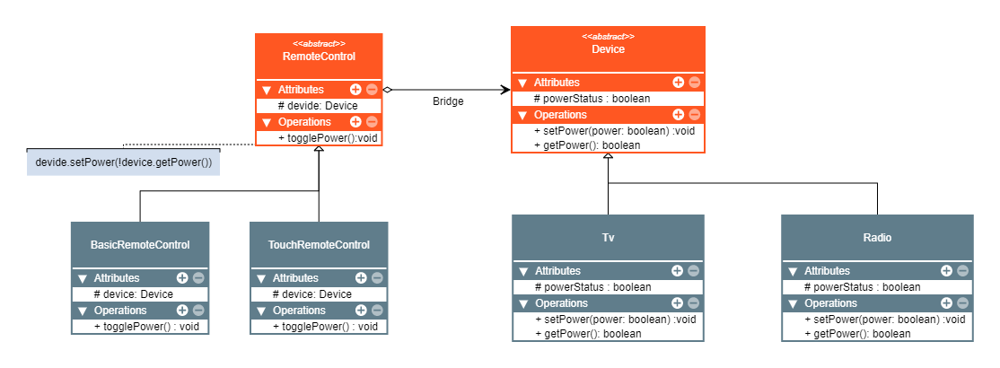

Igual ao adapter porém oque muda é a intenção

Bridge é um padrão de projeto estrutural que tem a intenção de desacoplar uma abstração da sua implementação, de modo que as duas possam variar e evoluir independentemente.

- **Abstração** é um código de alto nivel que geralmente delega ações para outro objeto.

- **Implementação** é o código que realmente faz o trabalho

> GOF pag 208 - A diferença chave enrtre esses padrões está nas suas intenções... O padrão Adapter faz as coisas funcionarem após elas terem sido projetadas; O Bridge as faz funcionar antes que existam.

Exemplo simples

`device.ts`

```ts
export interface DeviceProtocol {
  setPower(power : boolean) : void;
  getPower() : boolean;
}
```

`tv.ts`

```ts
export class Tv implements DeviceProtocol {
  private powerStatus = false;

  setPower(power: boolean) {
    this.powerStatus = power;
  }

  getPower() : boolean {
    return this.powerStatus;
  }
}
```

`remoteControl.ts`

```ts
export class remoteControl {
  constructor(device: DeviceProtocol){};

  togglePower(){
    this.device.setPower(!(this.device.getPower()));
  }
}
```

`main.ts`

```ts
const tv = new Tv();
const remoteControlTv = new RemoteControl(tv);
remoteControlTv.togglePower();
```

## Decorator

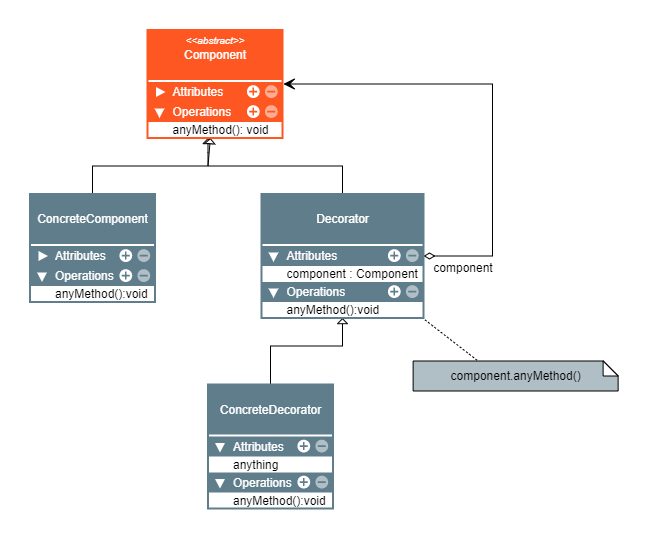

Agregar responsabilidades adicionais a um objetodinamicamente. Os decorator fornecem uma alternative flexivel ao uso de subclasses para extensão de funcionalidades

- Usa a composição ao inves de gerança
- É muito parecido com o composite porém tem a interção diferente
- É usada para adicionar funcionalidades a objetos em tempo de execução
- Finge ser o objeto sendo decorado, porém repassa chamadas de métodos para o mesmo
- Pode executar ações antes e depois das chamadas dos métodos do objeto decorado
- Pode manipular dados antes do retorno

Quanto utilizar?

- Quando for preciso adicionar funcionalidades no objeto sem quebrar o código anterior (Facilita para testes)
- For preferivel utilizar composição ao invés de herança

Exemplo

`productProtocol.ts`

```ts
export interface ProductProtocol {
  getName() : string;
  getPrice() : number;
}
```

`tshirt.ts`

```ts
export class Tshirt implements ProductProtocol {
  const name = 'Camisa';
  const price = 10.99;

  getName() {
    return this.name;
  }

  getPrice() {
    return this.price;
  }
}
```

`productDecorator.ts`

```ts
export class ProductDecorator implements ProductProtocol {
  constructor(protected product : ProductProtocol) {};

  getName(){
    return this.product.getName();
  }

  getPrice(){
    return this.product.getPrice();
  }
}
```

> Aqui acontece a mágica, alteramos o comportamento de um objeto sem que alteremos oque já foi construido. Dessa forma podemos criar vários decoradores de acordo com as mudanças de comportamento necessárias no objeto.

`productPrinted.ts`

```ts
export class ProducPrintedDecorator extends ProductDecorator {
  getName() {
    return this.product.getName() + ' Printed';
  }
}
```

## Facade

Facade (Fachada) é um padrão de projeto estrutural que tem a intenção de fornecer uma interface para um conjunto de interfaces em um subsistema. Facade define uma interface mais alta em um subsistema, o tornando mais fácil de ser utilizado.

Utilize quando você deseja:

- Disponibilizar uma interface simples para um sistema complexo
- Definir pontos de acessos no sistema

> Tome cuidado para não criar god class, se perceber que a classe está fazendo muita coisa, separe em mais fachadas :3

exemplo (Utilizando o exemplo do padrão Builder)

`Person.ts`

```ts
export class Person {
  constructor(public name?: string, public age?: number) {}
}
```

`personBuilder.ts`

```ts
import { Person } from './person';

export class PersonBuilder {
  private person = new Person();

  newPerson(): void {
    this.person = new Person();
  }

  setName(name: string): this {
    this.person.name = name;
    return this;
  }

  setAge(age: number): this {
    this.person.age = age;
    return this;
  }

  getResult(): Person {
    return this.person;
  }
}
```

personBuilderFacade.ts

```ts
export class PersonBuilderFacade {
  private personBuilder = new PersonBuilder();

  createPersonWithNameAlbert() {
    const person = this.personBuilder.setName('Albert').setAge(76).getResult();
    this.personBuilder.newPerson(); // Reset do builder
    return person
  }

  createPersonWithNameNikola() {
    const person = this.personBuilder.setName('Nicola').setAge(86).getResult();
    this.personBuilder.newPerson(); // Reset do builder
    return person
  }
}
```

`main.ts`

```ts
const personBulderFacade = new PersonBuilderFacade();

const albert = personBulderFacade.createPersonWithNameAlbert();
const nikola = personBulderFacade.createPersonWithNameNikola();

console.log(albert) // name: Albert, age: 76
console.log(nikola) // name: Nikola, age: 86
```

## Proxy


Padrão que tem a intenção de fornecer um substitudo ou marcador de localização para outro objeto para controlar o acesso a esse objeto.

- Usa composição, portanto tem a estrutura bem semelhante ao composite e decorator (Intenções diferentes)
- Usa um objeto proxy que finge ser o real
- Usado para controle de acesso, logs, cache e etc...
- Pode escolher como e quando repassar chamadas de métodos para o objeto real
- Pode executar ações antes e depois da chamada do objeto real
- Tem variações: proxy virtual, proxy remoto, proxy de proteção, proxy inteligente...

Alguns tipos de proxys

### Proxy virtual

Controla acesso a recursos que podem ser caros para criação ou utilização.

### Proxy remoto

Controla acesso a recursos que estão em servidores remotos

### Proxy de proteção

Executa ações de proteção de acordo com o recurso que será acessado. Camadas de validações de valores, autenticação, permissões etc...

### Proxy inteligente

Além de repassar chamadas ao objeto real, ele executa tarefas adicionais para saber quando isso é necessário e faz ações diferentes de acordo com as ações realizadas.

Exemplo de aplicabilidade, pois existem muitas, o limite é imaginação!

- (Proxy virtual) Limitar acesso direto a objetos caros de serem criados ou manuseados
- (Proxy de proteção) Limitar acesso a partes da aplicação
- (Proxy remoto) Ligar seu sistema com serviçois remotos
- (Proxy de cache) Utilizar chamadas guardadas que foram realizadas
- Interceptar qualquer chamada ao objeto real e realizar ações antes ou depois dela.

Exemplo

```ts
export interface SubjectProtocol {
  request(): void;
}

export class RealSubject implements SubjectProtocol{
  request(): void {
    console.log('Bora puxar o carro!')
  }
}

export class Proxy implements SubjectProtocol {
  constructor (private subject: SubjectProtocol){};
  request() : void {
    console.log('Faz algo diferente');
    this.subject.request();
    console.log('Faz algo diferente')
  }
}
```


